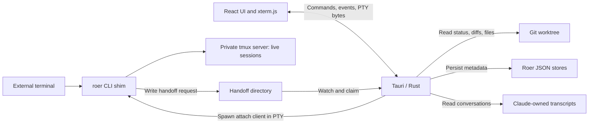

# Roer architecture questionnaire

Use this for a 45–60 minute architecture review. For each question, record an answer, rationale, owner, and evidence needed. Answer questions 1–5 first: they determine the scope and release bar for the remaining decisions.

This review is based on the checked-out implementation and README, not a runtime validation. Recommendations below are proposals; unanswered questions are not assumed decisions.

## Architectural overview

Roer hosts terminal sessions that move between a terminal emulator and a desktop app without restarting their processes. React/TypeScript renders the interface, xterm.js renders terminal output, and Tauri/Rust provides native operations. A shell CLI isolates the tmux session engine from the app.

The important boundaries are:

| Area | Current design | Implication |
| --- | --- | --- |
| Live sessions | tmux owns running processes; the CLI owns tmux-specific behavior | App restarts need not terminate sessions; the CLI is an architectural interface |
| Handoff | File requests move through pending, claimed, acknowledged or failed states | Ownership transfer depends on coordination across shell, Rust and React |
| Terminal lifecycle | Rust owns PTYs; xterm receives bytes through IPC; the terminal stays mounted beneath other views | UI cleanup can affect attachment, so lifecycle behavior is part of correctness |
| Repository views | Rust invokes Git and maintains file indexes/watchers; React displays bounded results | Large repositories stay out of frontend memory, but freshness and invalidation matter |
| Persistent state | Ended-session metadata, workspaces and projects live in JSON stores | Roer now owns user-created data in addition to derived history |
| Agent integration | Terminal hosting is generic; conversation discovery/resume includes Claude-specific behavior | Supporting another agent involves more than starting its executable |
| Delivery | macOS-oriented app and CLI distribution; CI runs frontend/Rust checks and shell syntax checks | Installed-app behavior needs evidence beyond unit tests |

Evidence: [README.md](air-file://t5oifs8rms2o4tjvp99a/workspaces/roer/README.md?type=file&root=%252F), [App.tsx](air-file://t5oifs8rms2o4tjvp99a/workspaces/roer/src/App.tsx?type=file&root=%252F), [lib.rs](air-file://t5oifs8rms2o4tjvp99a/workspaces/roer/src-tauri/src/lib.rs?type=file&root=%252F), [pty.rs](air-file://t5oifs8rms2o4tjvp99a/workspaces/roer/src-tauri/src/pty.rs?type=file&root=%252F), [workspaces.rs](air-file://t5oifs8rms2o4tjvp99a/workspaces/roer/src-tauri/src/workspaces.rs?type=file&root=%252F), [projects.rs](air-file://t5oifs8rms2o4tjvp99a/workspaces/roer/src-tauri/src/projects.rs?type=file&root=%252F).

## Questionnaire

### Product direction and guarantees

1. **What is the primary job for the next release?** Choose a priority: reliable terminal handoff, observing agent changes, or organizing work across projects. Which concrete user workflow must become measurably better? This decides whether effort goes into reliability, repository views, or workspace features.

2. **Which environments are explicitly supported?** Define macOS versions, terminal emulators, tmux versions, and installation methods. Are Linux, Windows, remote hosts or SSH sessions near-term requirements? The present design and release flow are macOS-oriented; portability should follow an explicit requirement.

3. **Is exactly one attached client a permanent product invariant?** Today a new attachment evicts the previous client and gives terminal sizing one owner. Would a future observer or shared session require read-only clients? Recommendation: preserve exclusive ownership until a concrete collaboration workflow justifies changing it.

4. **What does a successful handoff promise?** Is visible terminal output sufficient proof, and what should users see after timeout, app crash, failed attachment or two simultaneous requests? Define both the ownership result and the recovery action. Which latency and failure-rate targets should release testing enforce?

5. **How valuable is user-created metadata?** May workspace names, project attachments and session assignments ever reset silently? The workspace/project loaders currently return defaults for malformed JSON or an unsupported version. Recommendation: preserve unreadable originals and make recovery visible before treating this data as durable user work.

### Boundaries and data ownership

6. **How stable must the CLI contract be?** The app depends on CLI commands, environment overrides and TSV session output. Must an older app work with a newer shim, or vice versa? Decide whether capability/version negotiation and compatibility tests are necessary before distributing them independently.

7. **Should tmux remain the only session engine for the foreseeable future?** Its isolation behind the CLI already provides a useful boundary. What actual requirement would justify another engine? Recommendation: specify the current contract before building a generalized engine/plugin framework.

8. **What identifies a project over time?** Projects are deduplicated by resolved worktree path and can belong to multiple workspaces; sessions have at most one workspace assignment. What should happen when a repository moves, a worktree is deleted, or the same repository has several worktrees? Define whether identity follows a directory, repository or work item.

9. **What consistency does metadata require?** JSON writes use a temporary file plus rename, but atomic replacement alone does not define serialization of concurrent read-modify-write operations or coordinated updates between stores. Should commands be serialized, and how should partial updates recover? Decide required behavior before choosing locks, a shared store or a database.

10. **How far should agent-specific integration go?** Should Claude remain the only conversation-resume integration, or should another provider be supported next? Decide who owns conversation identity, transcript compatibility, discovery scope and permission defaults. Recommendation: keep generic session hosting separate from provider-specific resume behavior.

### Responsiveness and correctness

11. **Which scale and latency targets matter to real users?** The repo already contains large-index optimizations and benchmarks. Specify representative repository size, concurrent sessions, cold-search latency, warm-search latency and memory budget. Treat README benchmark figures as prior measurements to reproduce, not release guarantees.

12. **How stale may repository views become?** Watchers, incremental index patches and periodic rebuilding balance freshness against cost. Define behavior for dropped events, ignore-rule changes, external staging/commits, branch switches and a session changing directory. In particular, validate staged/unstaged freshness when only Git metadata changes; the README says the watcher skips Git internals.

13. **When should session orchestration move out of the root React component?** The app coordinates handoff queues, attach proof, session selection and tabs. Is that still easy to reason about as features grow? Recommendation: extract an explicit lifecycle/state machine when it reduces transition complexity, retaining behavior tests around races and cleanup.

14. **What operational evidence is needed when handoff fails?** Can a user distinguish a missing shim, absent tmux, refused window activation, attach failure and watcher failure? Define local diagnostics with a request/session correlation identifier and bounded retention. Decide explicitly whether any terminal content is ever captured; default to metadata-only diagnostics.

### Validation and delivery

15. **What must be tested with real processes?** Existing frontend tests exercise handoff races and UI behavior; CI also runs Rust tests. Which guarantees require the installed app, real tmux, the shim and a PTY together? Recommendation: cover app-to-terminal and terminal-to-app transfer, continued process identity, timeout, crash/restart and competing requests.

16. **What is the distribution quality bar?** The README documents separate app/CLI installation and a quarantine-removal step for an unnotarized app. Is the next milestone an internal preview or broader distribution? Decide ownership of installer simplicity, app/shim compatibility, signing/notarization and an installed-bundle smoke test accordingly.

For each answer, use: **Decision:** … **Why:** … **Owner:** … **Evidence/acceptance criterion:** … **Revisit when:** …

## Proposed next steps

The order below assumes the next milestone is a reliable local macOS preview. Reorder it after answering questions 1–5.

| Priority | Concrete deliverable | Driven by | Completion evidence |
| --- | --- | --- | --- |
| 1 | Record the supported environment, exclusive-ownership invariant and handoff success/failure contract in short architecture decision records | 1–4, 6–7 | Every supported handoff outcome has an ownership result and recovery action |
| 2 | Add a real-process handoff test harness; retain a manual installed-app activation check where automation is impractical | 4, 15–16 | A long-running process keeps the same identity across both transfer directions; timeout, crash and competing-request cases end in defined states |
| 3 | Define and implement metadata recovery and mutation consistency | 5, 8–9 | Corrupt/unsupported stores remain recoverable; representative concurrent mutations preserve changes; interrupted related-store updates have a documented recovery path |
| 4 | Add actionable local diagnostics around the transfer lifecycle and installation checks | 4, 14 | A failed transfer can be traced through request, claim, attach and acknowledgement without recording terminal content |
| 5 | Establish a reproducible repository-view performance and freshness suite | 11–12 | Chosen latency/memory budgets pass; external staging, branch switches, ignored tracked files and watcher recovery produce correct views |
| 6 | Select one product expansion based on the review | 1–2, 10, 13, 16 | A written acceptance workflow guides either workspace improvements, another agent integration, portability or distribution work |

Avoid scheduling an engine rewrite, database migration or broad component refactor solely from this review. Each should follow an agreed requirement or reproduced failure.

Validation scope: source/documentation review only. Existing tests and CI configuration were inspected; application tests, benchmarks and macOS handoffs were not executed for this document. No end-to-end desktop test job appears in the inspected CI workflow; this is not proof that no separate integration testing exists.

Supporting test/CI references: [App.test.tsx](air-file://t5oifs8rms2o4tjvp99a/workspaces/roer/src/App.test.tsx?type=file&root=%252F), [ChangesView.test.tsx](air-file://t5oifs8rms2o4tjvp99a/workspaces/roer/src/ChangesView.test.tsx?type=file&root=%252F), [ci.yml](air-file://t5oifs8rms2o4tjvp99a/workspaces/roer/.github/workflows/ci.yml?type=file&root=%252F).
