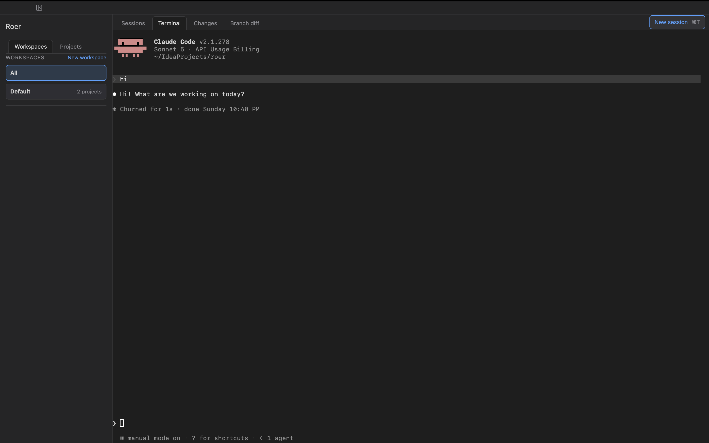
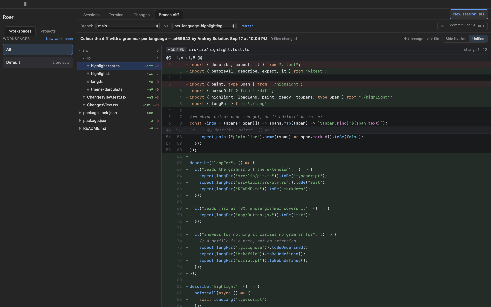
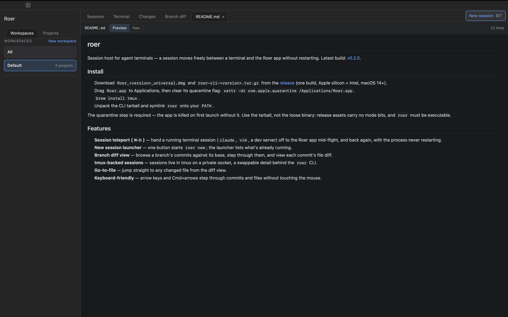

# roer

Session host for agent terminals — a session moves freely between a terminal and the Roer app without restarting.
Latest build: [v0.3.0](https://github.com/JetBrains/roer/releases/tag/v0.3.0).

## Install

1. Download `Roer_<version>_universal.dmg` and `roer-cli-<version>.tar.gz` from the [release](https://github.com/JetBrains/roer/releases/tag/v0.3.0) (one build, Apple silicon + Intel, macOS 14+).
2. Drag `Roer.app` to Applications, then clear its quarantine flag: `xattr -dr com.apple.quarantine /Applications/Roer.app`.
3. `brew install tmux`.
4. Unpack the CLI tarball and symlink `roer` onto your `PATH`.

The quarantine step is required — the app is killed on first launch without it. Keep `roer` and `roer-tmux.conf` together in the directory you unpack them into: `roer` finds its config beside itself.

### From a checkout

`cargo build --manifest-path cli/Cargo.toml` builds `roer` into `cli/target/debug/roer`; a debug build finds `scripts/roer-tmux.conf` on its own. `export ROER_BIN=$PWD/cli/target/debug/roer` points `npm run tauri dev` at it.

### Linux

The Linux app is not published to releases yet (the `roer` command is); the `roer-linux` artifact of a [Nightly bundles](../../actions/workflows/nightly-bundles.yml) run has a `.deb`, `.rpm` and `.AppImage`.

1. Install the `.deb` or `.rpm` (it pulls in `tmux`), or install `tmux` yourself and use the `.AppImage`.
2. Unpack `roer-cli-<version>-linux-x86_64.tar.gz` and symlink `roer` onto your `PATH`, as on macOS.
3. Using the AppImage: `export ROER_APP=/path/to/Roer.AppImage`, so `roer handoff` can start the app. The packages install it as `roer-app`, which `roer` finds on its own.

Shortcuts use `Ctrl+Shift` instead of `⌘` (`Ctrl+Shift+T` new session, `Ctrl+Shift+O` Go to File) and `Alt+←`/`Alt+→` to step through commits, leaving plain `Ctrl` keys to the terminal.

### Windows

A preview, natively in PowerShell (no WSL). Sessions run on [psmux](https://github.com/psmux/psmux), a tmux reimplementation on ConPTY. The builds are unsigned, so SmartScreen warns on install.

1. Run `Roer_<version>_x64-setup.exe`. It installs the app and the `roer` command together (`roer.exe` with `psmux.exe`, in the app's `roer\` folder) and adds that folder to your user `PATH`.
2. In a new terminal: `roer shell`, then `M-h` to hand the session to the app.

The `.msi` installs the same files but does not touch `PATH`: add `<install folder>\roer` yourself. `roer-cli-<version>-windows-x64.zip` is the command alone, for use without the app; keep its four files together, since `roer.exe` finds `roer-tmux.conf` and `psmux.exe` beside itself.

Shortcuts are as on Linux. Not there yet on Windows: session titles (psmux reports the console's title rather than the one Claude Code sets), and `C-b` is taken off psmux's prefix but not yet checked with real keypresses. Between releases, the `roer-windows` artifact of a [Nightly bundles](../../actions/workflows/nightly-bundles.yml) run has the installers and the CLI zip.

## Screenshots

**Generative UI** — a plugin drafts a UI as A2UI-shaped JSON and shows it live in Roer's panel; save it as a project-local bundle to reload later.

**Go to File** (`⌘⇧O`) — blazing fast, fuzzy-matched jump to any changed file straight from the diff view.

**Teleported `claude` session** — a running session hands off from the terminal to the Roer app without restarting.

**Branch diff view** — step through a branch's commits against its base and view each commit's file diff.

**Markdown preview** — view rendered Markdown for any changed file straight from the diff view.

## Features

- **Session teleport (`M-h`)** — hand a running terminal session (`claude`, `vim`, a dev server) off to the Roer app mid-flight, and back again, with the process never restarting.
- **New session launcher** — one button starts `roer new`; the launcher lists what's already running.
- **Branch diff view** — browse a branch's commits against its base, step through them, and view each commit's file diff.
- **Pull Request tab** — for the session's branch, through your own `gh` login: let Claude draft the title and description, push and open the PR, request a Copilot review (Roer polls until it lands), then pick review threads and send them to the session with **Fix with Claude**. Under the hood the tab uses `roer send` (type a prompt into a session) and `roer pr-draft` (the agent hands a draft back).
- **tmux-backed sessions** — sessions live in tmux on a private socket, a swappable detail behind the `roer` CLI.
- **Go-to-file** — jump straight to any changed file from the diff view.
- **Keyboard-friendly** — arrow keys and Cmd+arrows step through commits and files without touching the mouse.
